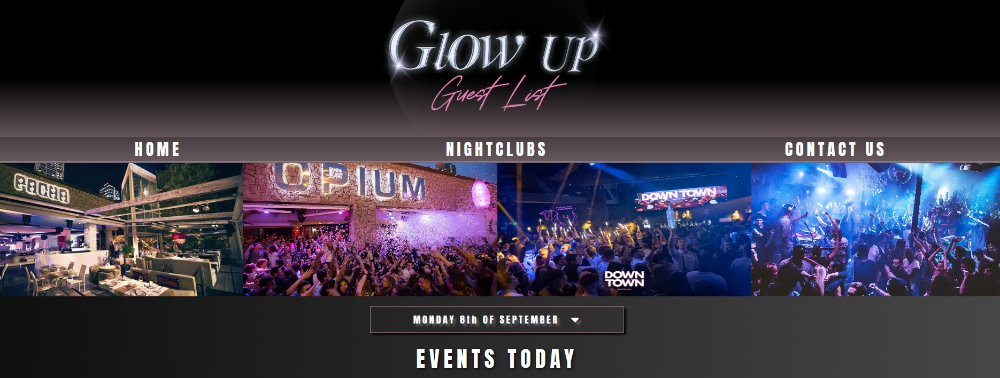
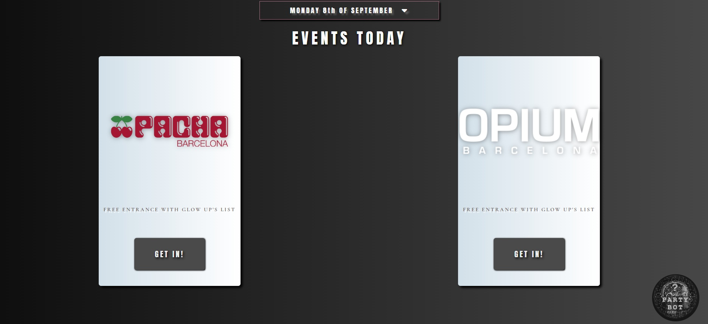
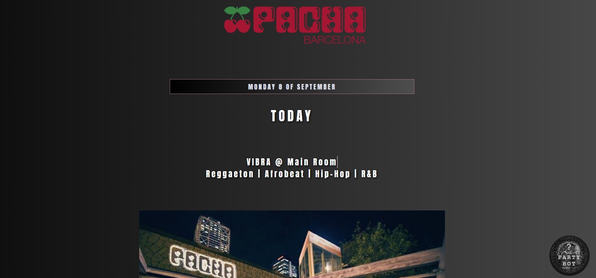
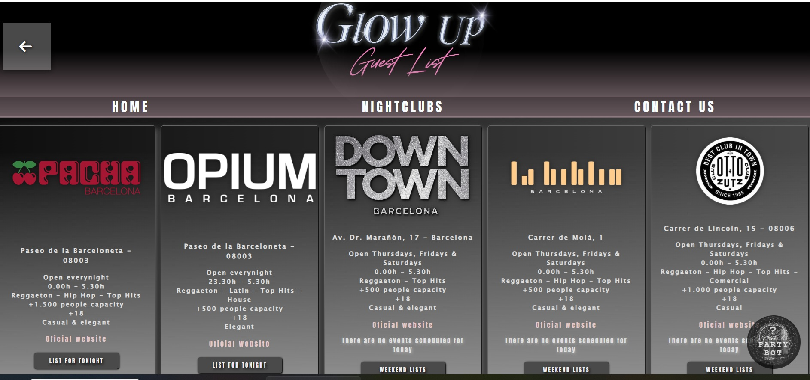
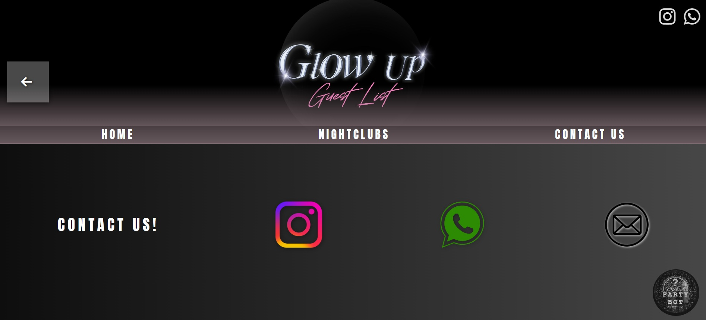

# "Glow up"
This is a website to promote nightclubs in Barcelona. On the main page, depending on the day of the week, it shows the nightclubs that are open tonight. By clicking on each one, you can access its information, photos, and an external link to buy tickets. You can also select another day of the week to see which nightclubs are open on that day.

There is a section called “Nightclubs” that displays all associated nightclubs. You can click on each one to see more information and also get tickets for the next available date.

## The project uses HTML, CSS, JavaScript, and Django

## Live Demo
🔗 <a href="http://maurofavieri.pythonanywhere.com">Click here to see the project live</a>

## Screenshots
.

Author / Contact
Name: Mauro Favieri Robles

LinkedIn: http://www.linkedin.com/in/mauro-favieri-robles-a693942b0

GitHub: https://github.com/mauritoo0

Email: maurofavieri@hotmail.com
